

  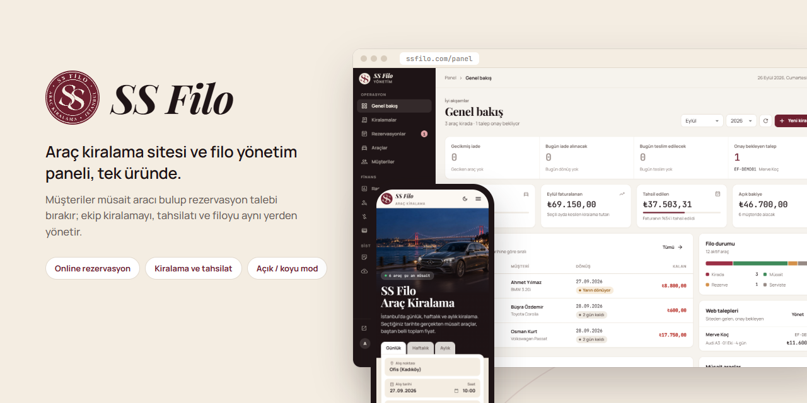

  <b>Araç kiralama işletmeleri için müşteri sitesi ve operasyon paneli.</b> 
  Müşteri müsait aracı bulup rezervasyon talebi bırakır; ekip kiralamayı, tahsilatı ve filoyu aynı yerden yönetir.

  
  
  
  
  
  

  <a href="#kiralama-sitesi">Kiralama sitesi</a> ·
  <a href="#yönetim-paneli">Yönetim paneli</a> ·
  <a href="#açık-ve-koyu-mod">Açık / koyu mod</a> ·
  <a href="#mobil">Mobil</a> ·
  <a href="#tasarım">Tasarım</a> ·
  <a href="#teknoloji">Teknoloji</a>

---

## Neden SS Filo

Küçük ve orta ölçekli kiralama işletmeleri genellikle iki ayrı dertle uğraşır: müşteri telefonla "şu tarihte hangi araç boş?" diye sorar, ekip ise kiralamaları, taksitleri ve borçları Excel'de takip eder.

SS Filo ikisini tek üründe birleştirir. **Kiralama sitesinde** müşteri seçtiği tarihte gerçekten müsait olan araçları ve baştan belli toplam fiyatı görür, dört adımda rezervasyon talebi bırakır. Talep **yönetim paneline** düşer; ekip onaylar, kiralamayı başlatır, ödemeleri alır ve filonun durumunu tek ekrandan izler.

> Bu depo bir ürün vitrinidir. Görsellerdeki müşteri adları, plakalar ve tutarlar demo verisidir.

---

## Kiralama sitesi

  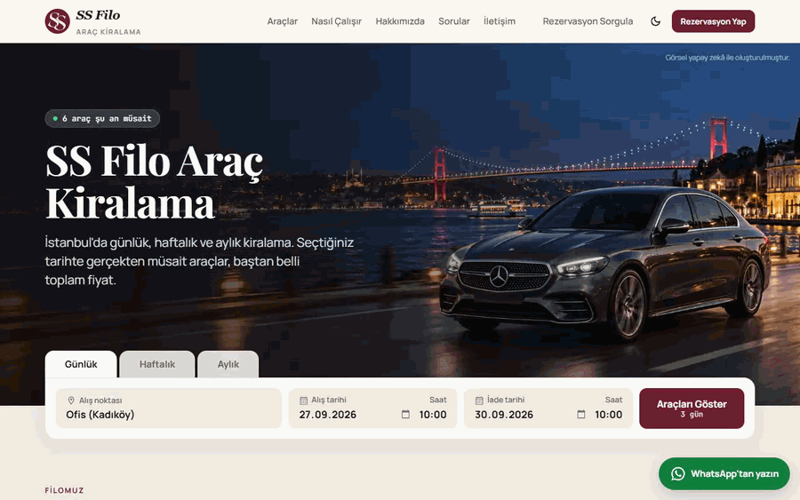
   Tarih seç → müsait araçları filtrele → aracı incele → dört adımda rezervasyon talebi

- **Gerçek müsaitlik.** Seçilen tarihlerde kirada, rezervli ya da serviste olan araçlar "dolu" görünür; fiyat ve toplam tutar sunucuda hesaplanır.
- **Dört adımlı rezervasyon.** Tarih ve teslim noktası → araç → iletişim bilgileri → özet. Sağdaki özet her adımda güncellenir.
- **Kodla takip.** Talep sonrası müşteriye `SS-XXXXXX` biçiminde bir kod verilir; durum telefon numarasıyla sorgulanır.
- **Teslim noktası seçimi.** Ofis, iki havalimanı ya da adrese teslim; araç detayından rezervasyona taşınır.
- **Filo sayfası.** Kategori, vites, yakıt, koltuk ve fiyat filtreleri; masaüstünde yan panel, mobilde alttan açılan çekmece.

<table>
  <tr>
    <td width="50%">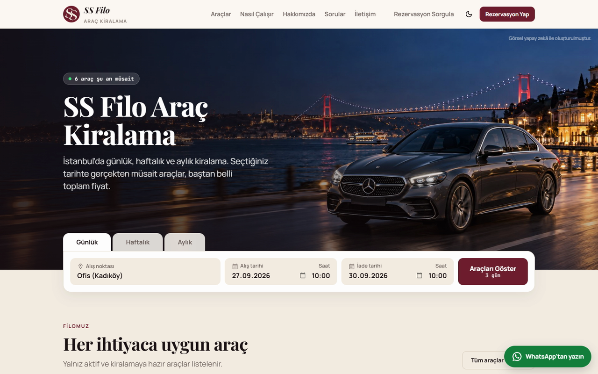 <b>Ana sayfa</b> · süre sekmeli arama kutusu, teslim noktaları, koşullar</td>
    <td width="50%">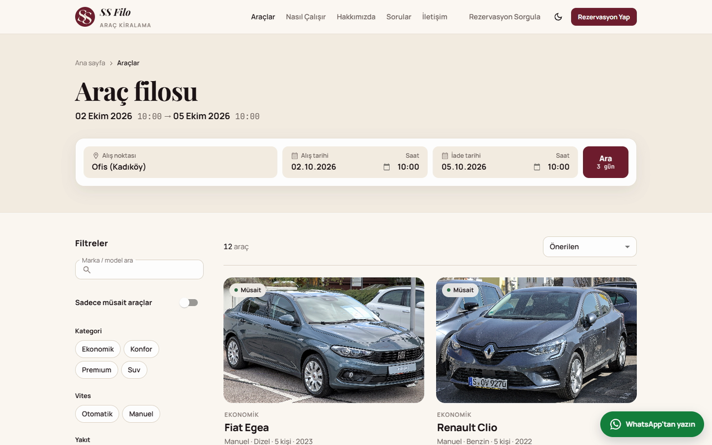 <b>Filo</b> · seçili tarihlere göre müsaitlik ve toplam fiyat</td>
  </tr>
  <tr>
    <td width="50%">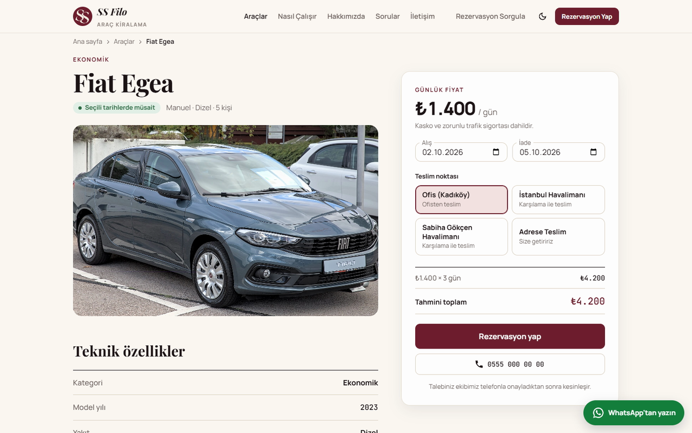 <b>Araç detayı</b> · teknik özellikler, teslim noktası, anlık fiyat hesabı</td>
    <td width="50%">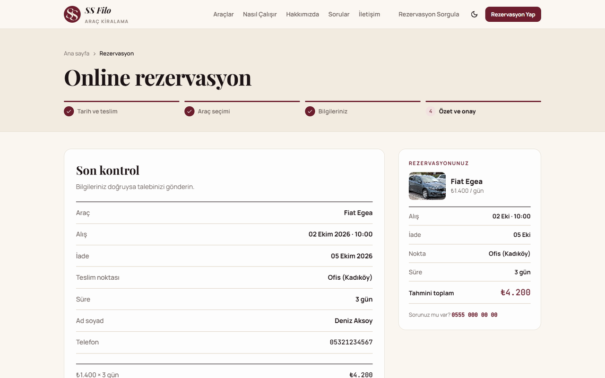 <b>Rezervasyon</b> · adım göstergesi ve sabit özet kartı</td>
  </tr>
</table>

---

## Yönetim paneli

  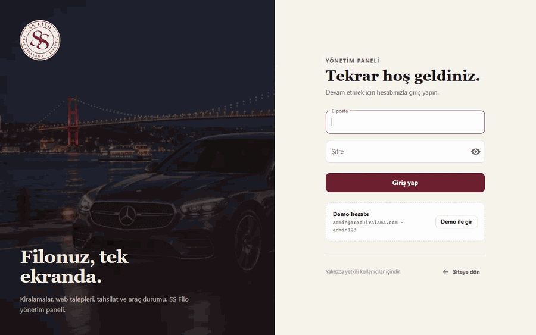
   Demo girişi → genel bakış ve gelir grafiği → kiralamalar → ödeme alma → araç galerisi

- **Genel bakış.** "Bugün" şeridi gecikmiş iadeleri, bugün dönecek ve teslim edilecek araçları, onay bekleyen web taleplerini öne çıkarır. Doluluk, tahsilat oranı ve aylık gelir tek bakışta görünür.
- **Kiralamalar.** Durum sekmeleri, araç, bakiye ve tarih filtreleri, Excel'e aktarma. Her satırda tek ana işlem (teslim al), geri kalanı "⋯" menüsünde.
- **Ödeme alma.** Kalanın tamamını ya da yarısını tek tıkla doldurma, nakit / kart / havale, ödeme sonrası bakiyenin önizlemesi.
- **Yeni kiralama.** Numaralı form bölümleri ve yazdıkça güncellenen özet; toplamdan günlük ücrete çeviren hesaplama yardımcısı.
- **Araçlar.** Galeri ve liste görünümü, sitede yayınla / gizle anahtarı, fotoğraf yönetimi, servise alma, arşiv.
- **Web talepleri.** Siteden gelen rezervasyonları onaylama ya da iptal etme; başlangıca kalan süre.
- **Finans.** Aylık raporlar, müşteri bazında borçlar, kalem kalem ödenmeyen borç tablosu, araç giderleri.
- **Sistem.** Satır satır not defteri; Excel, PDF ve teknik (JSON) yedek; sunucuda zamanlanmış otomatik yedekleme.

<table>
  <tr>
    <td width="50%">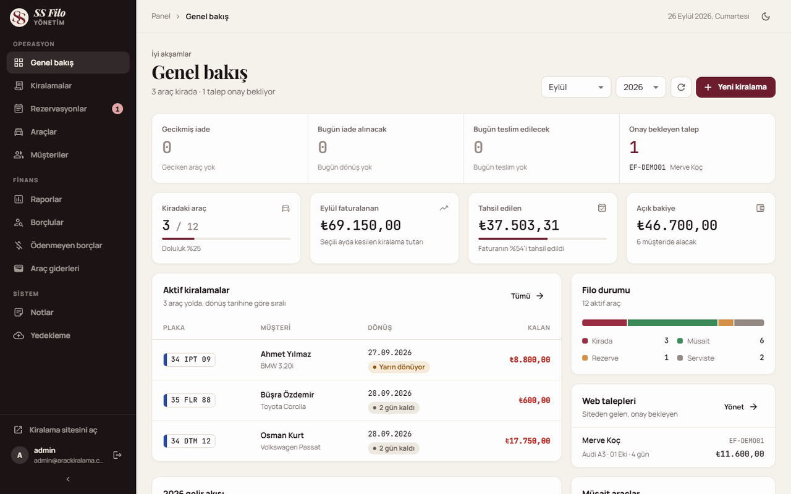 <b>Genel bakış</b> · bugün şeridi, göstergeler, aktif kiralamalar</td>
    <td width="50%">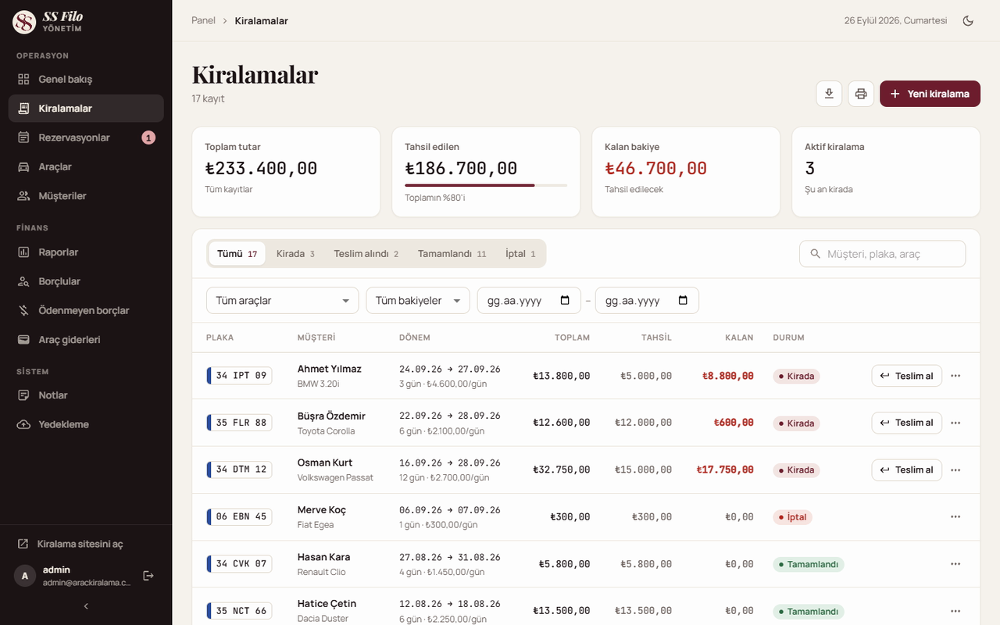 <b>Kiralamalar</b> · sayılı durum sekmeleri ve filtreler</td>
  </tr>
  <tr>
    <td width="50%">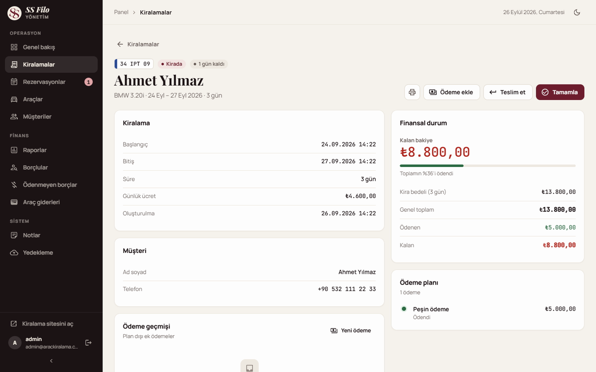 <b>Kiralama detayı</b> · finansal durum ve ödeme planı</td>
    <td width="50%">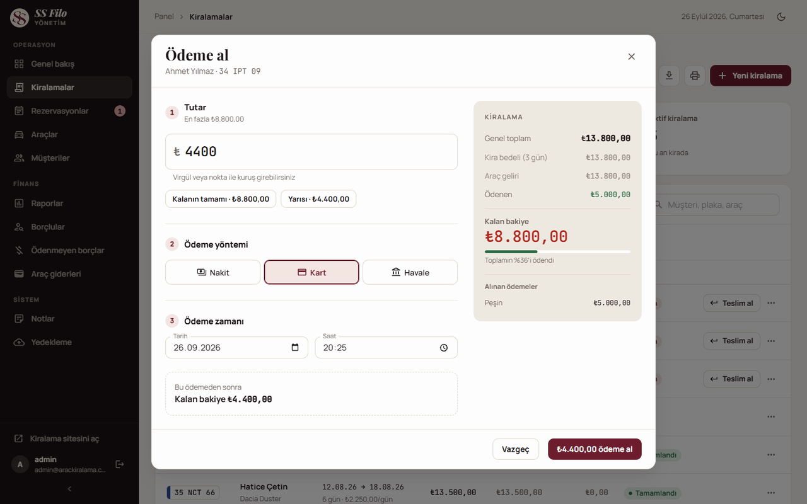 <b>Ödeme al</b> · hızlı doldurma ve bakiye önizlemesi</td>
  </tr>
  <tr>
    <td width="50%">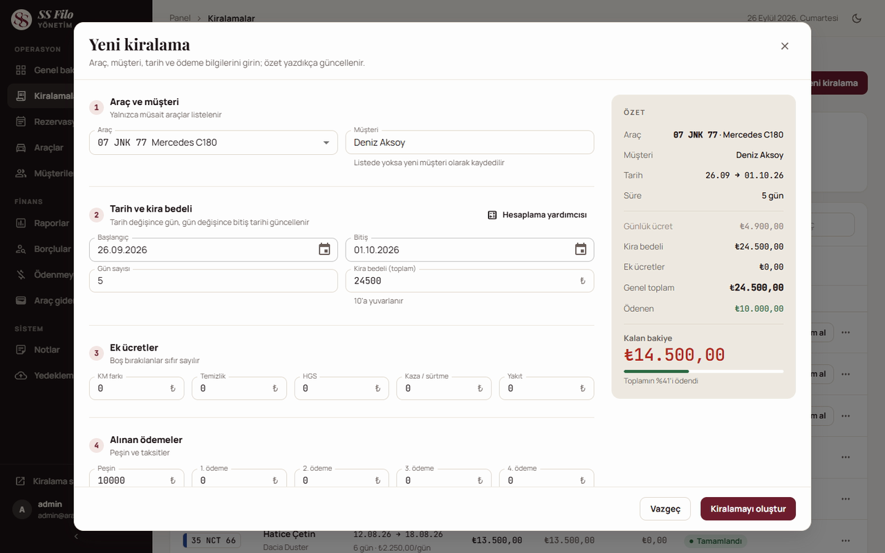 <b>Yeni kiralama</b> · canlı özet paneli</td>
    <td width="50%">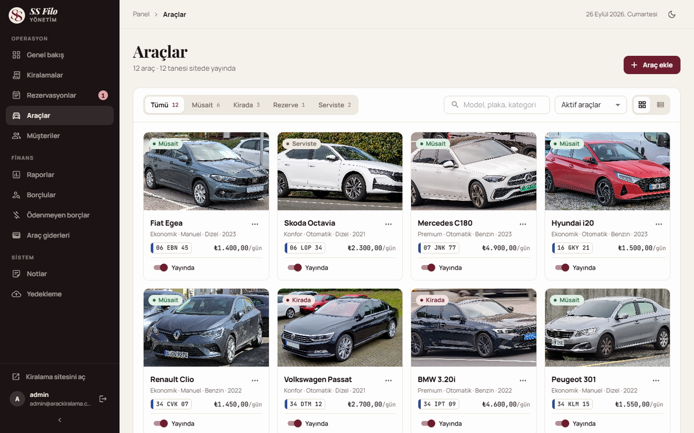 <b>Araçlar</b> · galeri görünümü ve yayın anahtarı</td>
  </tr>
  <tr>
    <td width="50%">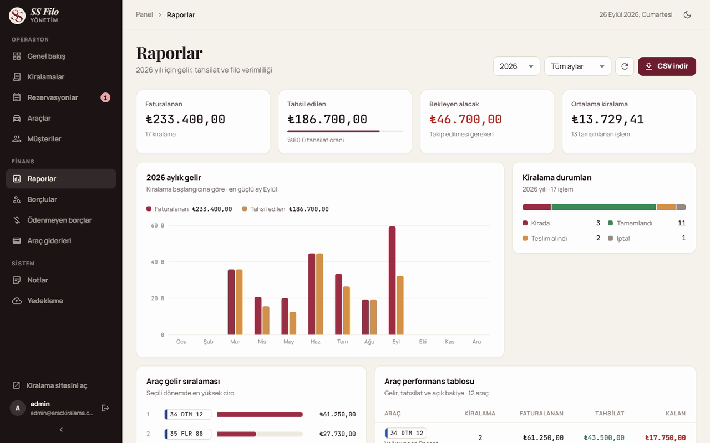 <b>Raporlar</b> · aylık gelir, durum dağılımı, araç sıralaması</td>
    <td width="50%">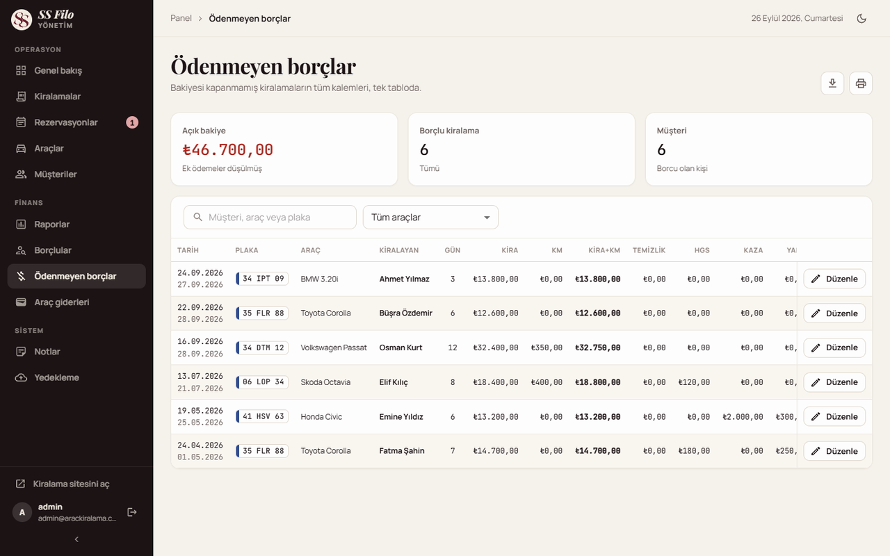 <b>Ödenmeyen borçlar</b> · tüm ücret kalemleri tek tabloda</td>
  </tr>
</table>

---

## Açık ve koyu mod

  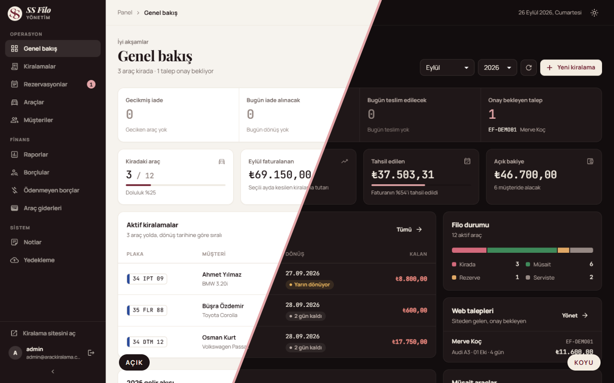

Site ve panelin her ekranı iki modda da çalışır. Koyu mod açık temanın tersine çevrilmiş hali değildir; zemin, çizgi ve durum renkleri ayrı ayarlanmıştır, butonlar krem zemin üzerinde bordo yazıya döner. Tercih hatırlanır ve sayfa açılışında beyaz parlama olmaz.

  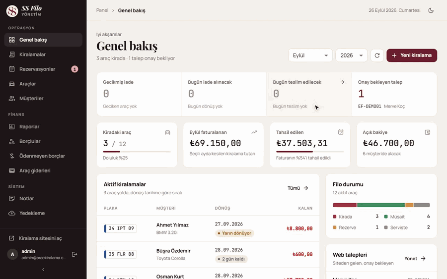

---

## Mobil

  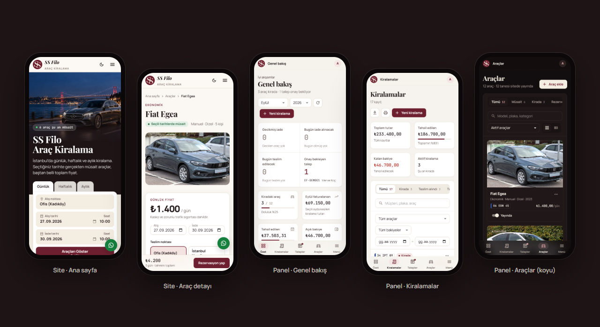

Tüm ekranlar telefona göre yeniden düzenlenir: sitede araç detayında alta sabit bir fiyat ve rezervasyon çubuğu, filo sayfasında alttan açılan filtre çekmecesi; panelde alt sekme çubuğu ve tablolar yerine kart listeleri.

---

## Tasarım

  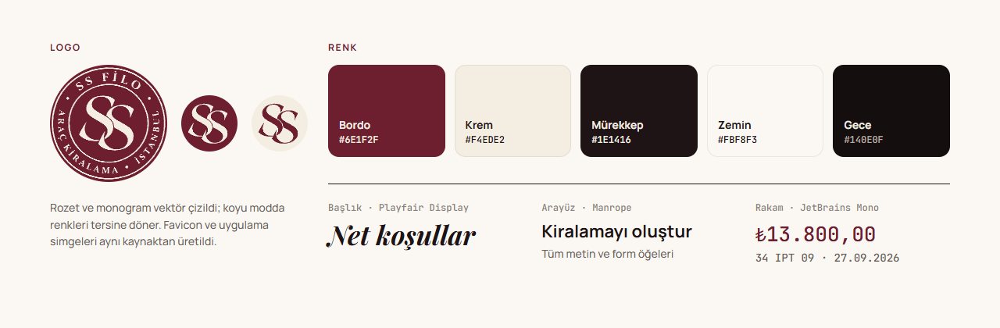

- **Kimlik.** "Rozet" logosu ve bordo–krem palet sitenin de panelin de temelini oluşturur. Başlıklarda Playfair Display, arayüzde Manrope, tutar, plaka ve tarihlerde alt alta hizalanan JetBrains Mono kullanılır.
- **Tasarım token'ları.** Renkler CSS değişkeni olarak iki palette (açık / koyu) tanımlıdır; bileşenler sabit renk yerine bu token'ları kullanır.
- **Grafikler.** Gelir ve filo grafikleri projeye özel SVG bileşenleridir; renkleri renk körlüğü testlerinden geçirilmiş paletten gelir, her seri etiketle de belirtilir.
- **Ayrıntılar.** Klavye odağı görünür, dokunma hedefleri büyük, durum rozetleri renk + metinle anlatılır.

---

## Teknoloji

**Arayüz**
- [React 18](https://react.dev) ve [TypeScript](https://www.typescriptlang.org) – uygulama
- [Vite](https://vitejs.dev) – geliştirme ve derleme
- [MUI](https://mui.com) – bileşen altyapısı, üzerine projeye özel tasarım sistemi
- [TanStack Query](https://tanstack.com/query) – sunucu verisi ve önbellek
- [React Hook Form](https://react-hook-form.com) + [Zod](https://zod.dev) – formlar ve doğrulama
- [React Router](https://reactrouter.com) – site ve panel yönlendirmesi

**Sunucu**
- [Node.js](https://nodejs.org) + [Express](https://expressjs.com) – REST API
- [Zod](https://zod.dev) – istek doğrulama
- [JWT](https://jwt.io) – panel oturumu; [Helmet](https://helmetjs.github.io) ve [express-rate-limit](https://github.com/express-rate-limit/express-rate-limit) – güvenlik başlıkları ve istek sınırı
- [Multer](https://github.com/expressjs/multer) – araç fotoğrafı yükleme; yerel, [Cloudinary](https://cloudinary.com) ya da S3 uyumlu depolama
- [node-cron](https://github.com/node-cron/node-cron) – zamanlanmış yedekleme

**Veri**
- [PostgreSQL](https://www.postgresql.org) – veritabanı
- [Prisma](https://www.prisma.io) – ORM ve migration'lar

**Dışa aktarma ve test**
- [SheetJS](https://sheetjs.com) – Excel; [jsPDF](https://github.com/parallax/jsPDF) – PDF rapor
- [Vitest](https://vitest.dev) ve [Jest](https://jestjs.io) – arayüz ve servis testleri

---

## Künye

- Araç fotoğrafları [Wikimedia Commons](https://commons.wikimedia.org)'tan, yazarlarının seçtiği CC BY / CC BY-SA lisanslarıyla kullanılmıştır. Yazar ve lisans listesi: [`docs/brand/vehicle-photo-credits.md`](docs/brand/vehicle-photo-credits.md). Görseller ilgili modelin temsilidir.
- Ana sayfadaki kapak görseli yapay zekâ ile oluşturulmuştur.
- Uygulamadaki müşteri, plaka, tutar ve iletişim bilgileri kurgusal demo verisidir.
